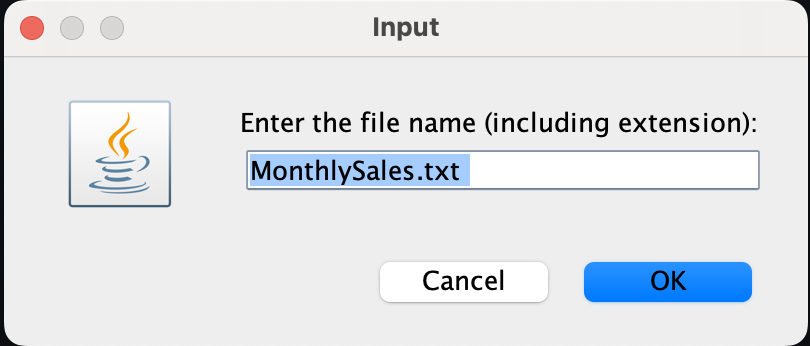

# Java Class Monthly Sales App

This is a simple Java class that calculates statistics regarding monthly sales. The class has a main method that reads the sales for each month from the provided text file and calculates the total sales, average sales, and the month with the highest/lowest sales. The statistics are then printed shown in a dialog box.

## Running the App

```bash
jenv local 17 && \
./buildAndRun.sh
```

## In Action



